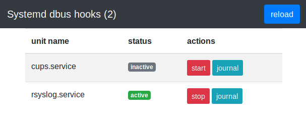

sd-dbus-hooks
=============

Сервис, который подписывается на события от systemd и выполняет определённые действия при
определённых событиях.

Дополнительно, предоставляет несколько простых http entrypoints длязапуска, остановки, просмотра
статуса и журнала юнита; и простой webui, использующий эти entrypoints.



Cобытия и действия
------------------

Каждый unit в списке конфигурации units имеет следующие параметры:

* **name** - полное имя юнита
* **on_active**,  - список действий, которые выполняются, когда юнит переходит в состояния
  **active**, **activating**
* **on_inactive** - список действий, которые выполняются, когда юнит переходит в состояния
  **inactive**, **deactivating**
* **on_failed** - список действий, которые выполняются, когда юнит переходит в состояние **failed**
* **blocked_by** - список сервисов. Если какой-нибудь из них в статусах **active** или **activating**,
  то при вызове _/unit/start/{unit_start}_ будет возвращена ошибка.

Во всех параметрах **on_*** можно использовать следующие переменные:

* **{unit_name}** - будет заменено на имя юнита
* **{unit_state}** - будет заменено на статус, в который перешёл юнит

http entrypoints
----------------

Если в файле конфигурации указан параметр **http -> x_token**, то при выполнении http запроса его значение должно совпадать с заголовком **X-Header**.

* **/unit/status/** - возвращает json, содержащий статус всех юнитов, описанных в секции units
  конфигурации
* **/unit/status/{unit_name}** - возвращает json, содержащий статус юнита
* **/unit/start/{unit_name}** - запускает unit и возвращает StatusOK, если юнит запущен успешно
* **/unit/stop/{unit_name}** - останавливает unit и возвращает StatusOK, если юнит остановлен успешно
* **/unit/journal/{unit_name}** - возвращает text, содержащий последние N записей из journalctl по
  этому юниту (N по-умолчанию 20, можно изменить через параметр journal_num_entries).

Все entrypoints возвращают:

* InternalServerError и text в случае ошибки сервера
* BadRequest и text в случае, если указанное имя {unit_name} отсутсвует в секции units
  конфигурации
* Forbidden и text в случае, если значение заголовка X-Token не совпадает с параметром
  конфигурации x_token

Пример запроса:

```bash
curl -H 'X-Token: 123' localhost:8080/unit/status/rsyslog.service
```

Сборка
------

```bash
# for centos7
yum install -y systemd-devel
go get github.com/tierpod/sd-dbus-hooks
make bin/sd-dbus-hooks
```

Благодарности
-------------

* [halumein](https://github.com/halumein) за помощь с webui
